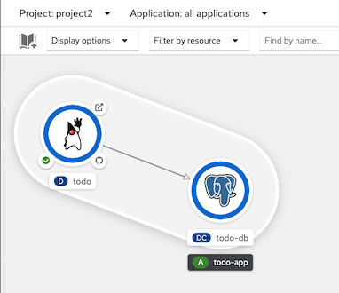
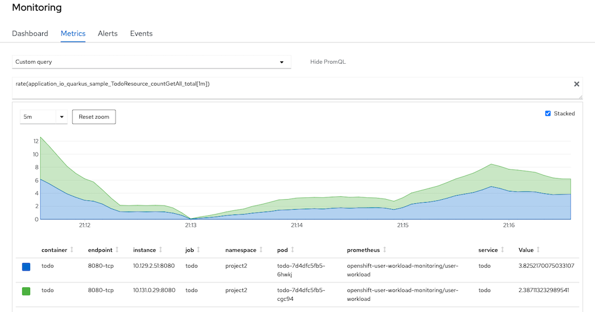

# TODO Application

- [TODO Application](#todo-application)
  - [Deploy on OpenShift](#deploy-on-openshift)
<!--  -->

<!-- ## Database -->

<!-- Run:

```bash
docker run --ulimit memlock=-1:-1 -it --rm=true --memory-swappiness=0 \
    --name postgres-quarkus-rest-http-crud -e POSTGRES_USER=restcrud \
    -e POSTGRES_PASSWORD=restcrud -e POSTGRES_DB=rest-crud \
    -p 5432:5432 postgres:13.1
``` -->
## Deploy on OpenShift
- Create PostgreSQL
  - [Deploy](etc/todo-db.yaml) by YAML
    
    ```bash
    oc apply -f etc/todo-db.yaml
    ```

- Deploy todo application
  
  - Developer Console
    - Add->From Git
    - Git Repository: https://github.com/voraviz/quarkus-todo-app
    - Select *Route* and add label *app=todo*

  - [Build](etc/todo-build.yaml) and [deploy](etc/todo.yaml) by YAMLs
  
    ```bash
    oc apply -f etc/todo-build.yaml
    oc apply -f etc/todo.yaml
    ```
    
    

- Monitor application's metrics with service monitor
  - Create [Service Monitor](etc/service-monitor.yaml) 
    
    ```bash
    oc apply -f etc/service-monitor.yaml
    ```

  - Scale todo to 2 pods
    
    ```bash
    oc scale deployment/todo --replicas=2
    ```

  - Run following command to gererate workload to getAll method
    
    ```bash
    siege -c 5 -t 5m -d 1 http://$(oc get route/todo -o jsonpath='{.spec.host}')/api
    ```

  - Developer Console, Monitoring->Metrics->Custom Query and select checkbox Stacked
    
    ```bash
    rate(application_io_quarkus_sample_TodoResource_countGetAll_total[1m])
    ```

    

- Test API
  - Get all todo 
  
    ```bash
    curl -v  http://$(oc get route/todo -o jsonpath='{.spec.host}')/api
    ```
  
  - Create todo
    
    ```bash
     curl -H "Content-type: application/json" \
     --data "@sample.json" -v \
     http://$(oc get route/todo -o jsonpath='{.spec.host}')/api
    ```
 
  - Delete todo number 1
   
    ```bash
    curl -v -X DELETE http://$(oc get route/todo -o jsonpath='{.spec.host}')/api/1
    ```
