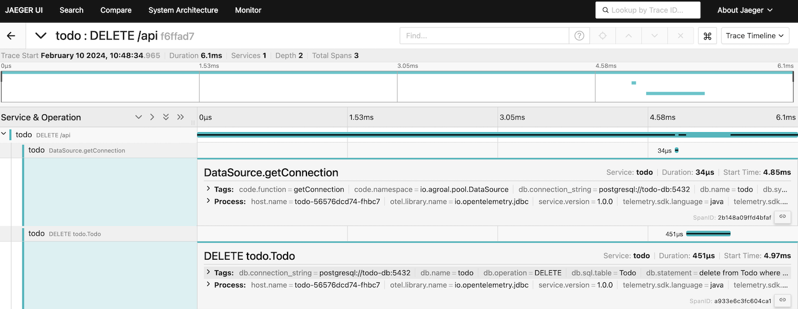
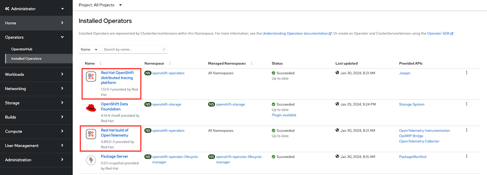
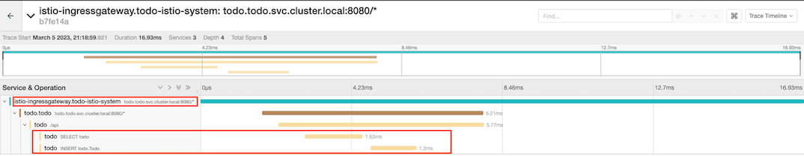

# TODO Application

- [TODO Application](#todo-application)
  - [Local Deployment](#local-deployment)
    - [OTEL and Jaeger](#otel-and-jaeger)
    - [To-Do App](#to-do-app)
    - [Test](#test)
  - [OpenShift - OpenTelemetry with Tempo](#openshift---opentelemetry-with-tempo)
    - [Prepare Object Storage (S3 Compatible)](#prepare-object-storage-s3-compatible)
    - [Deploy and configure OpenTelemetry](#deploy-and-configure-opentelemetry)
    - [Deploy Todo App and Test](#deploy-todo-app-and-test)
  - [OpenShift - OpenTelementry with Jaeger \[Deprecated soon\]](#openshift---opentelementry-with-jaeger-deprecated-soon)
    - [Install Operators](#install-operators)
    - [Deploy to-do app](#deploy-to-do-app)
    - [Test](#test-1)
  - [OpenShift - Service Mesh with OpenTelemetry \[Need to retest with Lastest OSSM\]](#openshift---service-mesh-with-opentelemetry-need-to-retest-with-lastest-ossm)
    - [Install Operators](#install-operators-1)
    - [Configure Service Mesh](#configure-service-mesh)

## Local Deployment

### OTEL and Jaeger
- Start OpenTelemetry and All-in-One Jaeger with Docker Compose
  
  ```bash
  cd etc/compose
  docker-compose up -d
  ```

### To-Do App

- Start Todo App in Dev Mode
  
  ```bash
  cd todo
  mvn quarkus:dev
  ```

### Test
- Access [todo app](http://localhost:8080/) then add and delete tasks
  
  - Delete and add tasks

     


- Access [Jaeger Console](http://localhost:16686) 
  - Select operation e.g. *UPDATE*
  
    

  - Overall trace detail
  
    

  - View span detail. Notice *SQL statement* and *duration*
  
    
  
## OpenShift - OpenTelemetry with Tempo
- Install Operators
    - Red Hat OpenShift distributed tracing data collection (OTEL)

    ```bash
    oc create -f etc/openshift/otel-sub.yaml
    ```
    - Tempo Operator by Red Hat
  
### Prepare Object Storage (S3 Compatible)
- Create S3 compatiable bucket on ODF
  
  - Admin Console
    - Navigate to Storage -> Object Storage -> Object Bucket Claims
    - Create ObjectBucketClaim
    - Claim Name: *loki*
    - StorageClass: *openshift-storage.nooba.io*
    - BucketClass: *nooba-default-bucket-class*
  
  - Use oc command with [YAML](etc/openshift/tempo-odf-bucket.yaml)              
    
    ```bash
    oc create -f etc/openshift/tempo-odf-bucket.yaml
    oc get objectbucketclaim.objectbucket.io/tempo -n openshift-storage
    ```

    Output

    ```bash
    NAME    STORAGE-CLASS                 PHASE   AGE
    tempo   openshift-storage.noobaa.io   Bound   18s
    ```

    
- Retrieve configuration into environment variables
  
  ``bash
   S3_BUCKET=$(oc get ObjectBucketClaim tempo -n openshift-storage -o jsonpath='{.spec.bucketName}')
   REGION="''"
   ACCESS_KEY_ID=$(oc get secret tempo -n openshift-storage -o jsonpath='{.data.AWS_ACCESS_KEY_ID}'|base64 -d)
   SECRET_ACCESS_KEY=$(oc get secret tempo -n openshift-storage -o jsonpath='{.data.AWS_SECRET_ACCESS_KEY}'|base64 -d)
   ENDPOINT="http://s3.openshift-storage.svc.cluster.local:80"
  ```
### Deploy and configure Tempo
- Create project
  
  ```bash
  oc new-project todo-tempo
  PROJECT=todo-tempo
  ```
- Create secret for TempoStack to access S3 bucket
  
  ```bash
  oc create secret generic tempo-s3 \
    --from-literal=name=tempo \
    --from-literal=bucket=$S3_BUCKET  \
    --from-literal=endpoint=$ENDPOINT \
    --from-literal=access_key_id=$ACCESS_KEY_ID \
    --from-literal=access_key_secret=$SECRET_ACCESS_KEY \
    -n $PROJECT
  ```

  <!-- *Remark: This config use ODF S3 route for TempoStack because service certificate is not trusted CA and cannot find the way to skip TLS verification* -->

- Create [TempoStack](etc/openshift/tempo-stack.yaml) with dev and prod tenant along with required roles.
  
  ```bash
  cat etc/openshift/tempo-stack.yaml | sed 's/PROJECT/'$PROJECT'/' | oc apply -n $PROJECT -f -
  oc get po -l  app.kubernetes.io/managed-by=tempo-operator -n $PROJECT
  ```
  
  Output

  ```bash
  NAME                                             READY   STATUS    RESTARTS   AGE
  tempo-simplest-compactor-5c5d9df594-8n8pf        1/1     Running   0          2m44s
  tempo-simplest-distributor-6df8c5884d-jqpcs      1/1     Running   0          2m44s
  tempo-simplest-gateway-5fd5b6df7f-cj8b9          2/2     Running   0          2m44s
  tempo-simplest-ingester-0                        1/1     Running   0          2m44s
  tempo-simplest-querier-869d85cf99-njjbg          1/1     Running   0          2m44s
  tempo-simplest-query-frontend-864c9594fb-9nv2v   2/2     Running   0          2m44s
  ```
### Deploy and configure OpenTelemetry
- Create [OTEL collector](etc/openshift/otel-collector-tempo.yaml) with exporter point to Tempo's gateway with dev tenant
  
  ```bash
  cat etc/openshift/otel-collector-tempo.yaml | sed 's/PROJECT/'$PROJECT'/' | oc apply -n $PROJECT -f -
  oc get po -l  app.kubernetes.io/managed-by=opentelemetry-operator -n $PROJECT
  ```
  
  Output
  
  ```bash
  NAME                             READY   STATUS    RESTARTS   AGE
  otel-collector-dcfcbfcfc-c2f96   1/1     Running   0          2m37s
  ```
### Deploy Todo App and Test
- Deploy todo app

  ```bash
  oc apply -n $PROJECT -k kustomize/overlays/otel
  ```
  
  Add some todo to todo app

- Open Jaeger Console provided by Tempo to access dev tenant
  
  ```bash
  echo "https://$(oc get route tempo-simplest-gateway -n $PROJECT -o jsonpath='{.spec.host}')/api/traces/v1/dev/search"
  ```

  Jaeger Console 

  
  
  SQL Statement
  
  

Reference: *[Tempo Document](https://grafana.com/docs/tempo/latest/setup/operator/quickstart/)*

## OpenShift - OpenTelementry with Jaeger [Deprecated soon]

### Install Operators

- Install following Operators

  - Red Hat OpenShift distributed tracing platform (Jaeger)

    ```bash
    oc create -f etc/openshift/jaeger-sub.yaml
    ```

  - Red Hat OpenShift distributed tracing data collection (OTEL)

    ```bash
    oc create -f etc/openshift/otel-sub.yaml
    ```

- Verify operators are installed successfully

   ```bash
   oc get csv
   ```

   Result

   ```bash
    NAME                               DISPLAY                                          VERSION    REPLACES                           PHASE
    jaeger-operator.v1.51.0-1          Red Hat OpenShift distributed tracing platform   1.51.0-1   jaeger-operator.v1.47.1-5          Succeeded
    opentelemetry-operator.v0.89.0-3   Red Hat build of OpenTelemetry                   0.89.0-3   opentelemetry-operator.v0.81.1-5   Succeeded
   ```

   OpenShift Console

   

- Create namespace for todo application

  ```bash
  oc new-project todo
  ```

- Create [Jaeger instance](etc/openshift/jaeger.yaml)
  
  ```bash
  oc create -f etc/openshift/jaeger.yaml -n todo 
  ```

  Check

  ```bash
  watch oc get po -l app.kubernetes.io/name=jaeger -n todo
  ```

  Result 

  ```bash
  NAME                      READY   STATUS    RESTARTS   AGE
  jaeger-867dcf97bd-xpjwq   2/2     Running   0          15s
  ```

- Create [OTEL instance](etc/openshift/otel-collector.yaml)
  
  Snippet from CRD
  
  ```yaml
    config: |
      receivers:
        otlp:
          protocols: 
            grpc:
            http:

      exporters:
        otlp:
          endpoint: "jaeger-collector-headless:4317"
          tls:
            insecure: true
  ```
  
  <!-- ```bash
  cat etc/openshift/otel-collector.yaml | sed 's/PROJECT/'$(oc project -q)'/' | oc apply -n todo -f -
  ``` -->
  ```bash
  oc create -f etc/openshift/otel-collector.yaml -n todo
  ```
  Check 

  ```bash
  watch oc get po -l app.kubernetes.io/component=opentelemetry-collector -n todo
  ```

  Result

  ```bash
  NAME                              READY   STATUS    RESTARTS   AGE
  otel-collector-657b9d9c6f-ncm5q   1/1     Running   0          108s
  ```

  Check on Developer Console

  


### Deploy to-do app
  
- Snippet from deployment with env for OTEL

  ```yaml
  spec:
    replicas: 1
    template:
      spec:
        containers:
        - name: todo
          env:
          - name: quarkus.otel.exporter.otlp.endpoint
            value: http://otel-collector-headless:4317
  ```
  
- Deploy with kustomize

  ```bash
  oc apply -k kustomize/overlays/otel -n todo
  ```

- Check 

  ```bash
  oc get po -l app=todo -n todo
  oc get po -l app=todo-db -n todo
  ```

  View Developer Console

  

### Test

- Add task to to-do app
  
  
- Login to jaeger
  
  

- View trace
  
  


## OpenShift - Service Mesh with OpenTelemetry [Need to retest with Lastest OSSM]

### Install Operators

- Install OpenShift Service Mesh and Kiali Operator

  ```bash
  oc create -f etc/openshift/service-mesh-sub.yaml
  oc create -f etc/openshift/kiali-sub.yaml
  ```

  Result

  ```bash
  NAME                               DISPLAY                                                 VERSION    REPLACES                           PHASE
  jaeger-operator.v1.39.0-3          Red Hat OpenShift distributed tracing platform          1.39.0-3   jaeger-operator.v1.34.1-5          Succeeded
  kiali-operator.v1.57.5             Kiali Operator                                          1.57.5     kiali-operator.v1.57.3             Succeeded
  opentelemetry-operator.v0.63.1-4   Red Hat OpenShift distributed tracing data collection   0.63.1-4   opentelemetry-operator.v0.60.0-2   Succeeded
  servicemeshoperator.v2.3.1         Red Hat OpenShift Service Mesh                          2.3.1-0    servicemeshoperator.v2.3.0         Succeeded
  ```

### Configure Service Mesh 
- Create Namespace for control plane
  
  ```bash
  oc new-project todo-istio-system
  ```
- Create control plane
  
  ```bash
  oc create -f etc/openshift/smcp.yaml -n todo-istio-system
  watch oc get smcp/basic -n todo-istio-system
  ```
  
  Result

  ```bash
  NAME    READY   STATUS            PROFILES      VERSION   AGE
  basic   9/9     ComponentsReady   ["default"]   2.3.1     65s
  ```

- Join namspace todo to control plane
  
  ```bash
  cat etc/openshift/smmr.yaml | \
  sed 's/PROJECT/todo/' | \
  oc create -n todo-istio-system -f -
  oc get smmr -n todo-istio-system 
  ```

  Result

  ```bash
  servicemeshmemberroll.maistra.io/default created
  NAME      READY   STATUS       AGE
  default   1/1     Configured   1s
  ```

- Add sidecar and rewrite Liveness and Readiness probe to todo
  
  ```yaml
    template:
      metadata:
        annotations:
          sidecar.istio.io/inject: "true"
          sidecar.istio.io/rewriteAppHTTPProbers: "true"
  ```

  Update deployment with Kustomize

  ```bash
  oc apply -k kustomize/overlays/istio -n todo
  watch oc get po -l app=todo -n todo
  ```

- Create DestinationRule, Gateway and VirtualService

  ```bash
  cat etc/openshift/todo-istio.yaml|sed 's/DOMAIN/'$(oc whoami --show-console|awk -F'apps.' '{print $2}')/|oc apply -n todo -f -
  ```

- Get Istio ingress gateway route

  ```bash
  oc get route  -n todo-istio-system|grep 'todo.apps'|awk '{print $2}'
  ```

- Open todo app with URL from previous step and check Kiali Graph
  
  

- Configure OTEL to send trace to Service Mesh's Jaeger
  - OpenShift Admin Console, select project todo then select Installed Operators
  - Select Red Hat OpenShift distributed tracing data collection and select OpenTelemetry Collector
  - Select otel
  - Change endpoint to jaeger-collector-headless.todo-istio-system.svc:14250

    

- Check Service Mesh's Jaeger that OpenTracing is sent to Service Mesh's Jaeger

  

- Check todo pod's log for Trace ID
  
  ```bash
   09:32:44 [io.qu.ht.access-log] (executor-thread-0) =127.0.0.6 - - 06/Mar/2023:09:32:44 +0000 "DELETE /api/ HTTP/1.1" 204 - "http://todo.apps.cluster-srlk7.srlk7.sandbox565.opentlc.com/todo.html" "Mozilla/5.0 (Macintosh; Intel Mac OS X 10_15_7) AppleWebKit/537.36 (KHTML, like Gecko) Chrome/110.0.0.0 Safari/537.36" traceId=f433a3102857a47bcb6323ba65ae893a spanId=503008fb528089d7
  ```
  
  You can search Trace ID from Jaeger Console

  