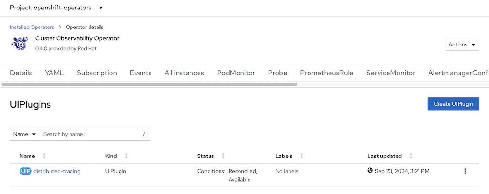
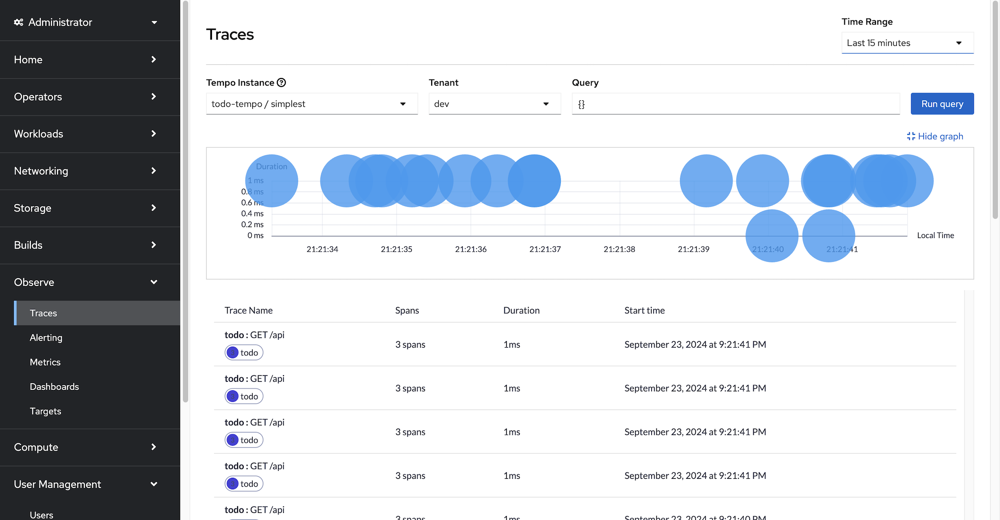
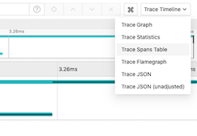
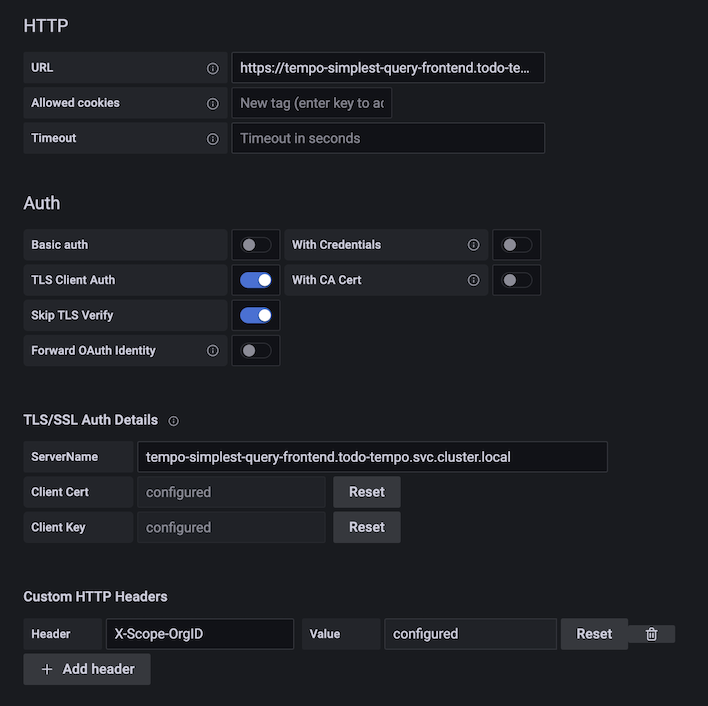

# TODO Application

- [TODO Application](#todo-application)
  - [Local Deployment](#local-deployment)
    - [OTEL and Jaeger](#otel-and-jaeger)
    - [To-Do App](#to-do-app)
    - [Test](#test)
  - [OpenShift - OpenTelemetry with Tempo](#openshift---opentelemetry-with-tempo)
    - [Operators Insallation](#operators-insallation)
    - [Prepare Object Storage (S3 Compatible)](#prepare-object-storage-s3-compatible)
      - [Leverage existing S3 bucket (from image registry)](#leverage-existing-s3-bucket-from-image-registry)
      - [OpenShift Data Foundatation](#openshift-data-foundatation)
    - [Deploy and configure Tempo](#deploy-and-configure-tempo)
    - [Deploy and configure OpenTelemetry](#deploy-and-configure-opentelemetry)
    - [Deploy Todo App](#deploy-todo-app)
    - [Tracing Console](#tracing-console)
      - [Tracing UI](#tracing-ui)
      - [Jaeger UI (Depecrated)](#jaeger-ui-depecrated)
      - [Grafana](#grafana)
    - [Auto-Instrumentation](#auto-instrumentation)

## Local Deployment

### OTEL and Jaeger
- Start OpenTelemetry and All-in-One Jaeger with Docker Compose
  
  ```bash
  cd etc/compose
  docker-compose up -d
  ```

### To-Do App

- Start Todo App in Dev Mode
  
  ```bash
  cd todo
  mvn quarkus:dev
  ```

### Test
- Access [todo app](http://localhost:8080/) then add and delete tasks
  
  - Delete and add tasks

     


- Access [Jaeger Console](http://localhost:16686) 
  - Select operation e.g. *UPDATE*
  
    

  - Overall trace detail
  
    

  - View span detail. Notice *SQL statement* and *duration*
  
    
  
## OpenShift - OpenTelemetry with Tempo
<!-- - If you are too busy to read the following steps just run this [script](setup-tempo-demo.sh) -->
### Operators Insallation
- Install Operators
    - [Distributed Tracing Data Collection Operator](etc/openshift/otel-sub.yaml) (OTEL)

      ```bash
      oc create -f etc/openshift/otel-sub.yaml
      ```

    - [Tempo Operator](etc/openshift/tempo-sub.yaml) by Red Hat

      ```bash
      oc create -f etc/openshift/tempo-sub.yaml
      ``` 

    - Verify operators are installed successfully
      
      ```bash
      oc get csv -n openshift-operators
      ```

      Output

      ```bash
      NAME                                DISPLAY                          VERSION     REPLACES                            PHASE
      opentelemetry-operator.v0.119.0-1   Red Hat build of OpenTelemetry   0.119.0-1   opentelemetry-operator.v0.113.0-2   Succeeded
      tempo-operator.v0.15.3-1            Tempo Operator                   0.15.3-1    tempo-operator.v0.14.1-2            Succeeded
      ```
  
### Prepare Object Storage (S3 Compatible)
####  Leverage existing S3 bucket (from image registry)
- For Demo only, Retrieve S3 configuration that already configured with OpenShift's internal image registry
  
  ```bash
  S3_BUCKET=$(oc get configs.imageregistry.operator.openshift.io/cluster -o jsonpath='{.spec.storage.s3.bucket}' -n openshift-image-registry)
  REGION=$(oc get configs.imageregistry.operator.openshift.io/cluster -o jsonpath='{.spec.storage.s3.region}' -n openshift-image-registry)
  ACCESS_KEY_ID=$(oc get secret image-registry-private-configuration -o jsonpath='{.data.credentials}' -n openshift-image-registry|base64 -d|grep aws_access_key_id|awk -F'=' '{print $2}'|sed 's/^[ ]*//')
  SECRET_ACCESS_KEY=$(oc get secret image-registry-private-configuration -o jsonpath='{.data.credentials}' -n openshift-image-registry|base64 -d|grep aws_secret_access_key|awk -F'=' '{print $2}'|sed 's/^[ ]*//')
  ENDPOINT=$(echo "https://s3.$REGION.amazonaws.com")
  DEFAULT_STORAGE_CLASS=$(oc get sc -A -o jsonpath='{.items[?(@.metadata.annotations.storageclass\.kubernetes\.io/is-default-class=="true")].metadata.name}')
  ```
####  OpenShift Data Foundatation
  
- Admin Console
  - Navigate to Storage -> Object Storage -> Object Bucket Claims
  - Create ObjectBucketClaim
  - Claim Name: *loki*
  - StorageClass: *openshift-storage.nooba.io*
  - BucketClass: *nooba-default-bucket-class*
  
- Use oc command with [YAML](etc/openshift/tempo-odf-bucket.yaml)              
    
  ```bash
  oc create -f etc/openshift/tempo-odf-bucket.yaml
  oc get objectbucketclaim.objectbucket.io/tempo -n openshift-storage
  ```

  Output

   ```bash
  NAME    STORAGE-CLASS                 PHASE   AGE
  tempo   openshift-storage.noobaa.io   Bound   18s
  ```
    
- Retrieve configuration into environment variables
    
  ```bash
  S3_BUCKET=$(oc get ObjectBucketClaim tempo -n openshift-storage -o jsonpath='{.spec.bucketName}')
  REGION="''"
  ACCESS_KEY_ID=$(oc get secret tempo -n openshift-storage -o jsonpath='{.data.AWS_ACCESS_KEY_ID}'|base64 -d)
  SECRET_ACCESS_KEY=$(oc get secret tempo -n openshift-storage -o jsonpath='{.data.AWS_SECRET_ACCESS_KEY}'|base64 -d)
  ENDPOINT="http://s3.openshift-storage.svc.cluster.local:80"
  ```

### Deploy and configure Tempo
- Create project
  
  ```bash
  oc new-project todo-tempo
  PROJECT=todo-tempo
  ```

- Create secret for TempoStack to access S3 bucket
  Remark: S3 bucket is not required if you use TempoMonolithic with in-memory storage
  ```bash
  oc create secret generic tempo-s3 \
    --from-literal=name=tempo \
    --from-literal=bucket=$S3_BUCKET  \
    --from-literal=endpoint=$ENDPOINT \
    --from-literal=access_key_id=$ACCESS_KEY_ID \
    --from-literal=access_key_secret=$SECRET_ACCESS_KEY \
    -n $PROJECT
  ```

  <!-- *Remark: This config use ODF S3 route for TempoStack because service certificate is not trusted CA and cannot find the way to skip TLS verification* -->

- Create [TempoStack](etc/openshift/tempo-stack-multi-tenant.yaml) with dev and prod tenant along with required roles.
  
  <!-- ```bash
  cat etc/openshift/tempo-stack-single-tenant.yaml | sed 's/PROJECT/'$PROJECT'/'  | oc apply -n $PROJECT -f -
  oc wait --for condition=ready --timeout=180s pod -l app.kubernetes.io/managed-by=tempo-operator  -n $PROJECT 
  oc get po -l  app.kubernetes.io/managed-by=tempo-operator -n $PROJECT
  ``` -->
  
  

 
<!-- - For Multi-tenant use [tempo-stack-multi-tenant.yaml](etc/openshift/tempo-stack-multi-tenant.yaml) -->
   
  ```bash
  cat etc/openshift/tempo-stack-multi-tenant.yaml | sed 's/PROJECT/'$PROJECT'/'  | oc apply -n $PROJECT -f -
  oc wait --for condition=ready --timeout=180s pod -l app.kubernetes.io/managed-by=tempo-operator  -n $PROJECT 
  oc get po -l  app.kubernetes.io/managed-by=tempo-operator -n $PROJECT
  ```

  Output

  ```bash
  NAME                                             READY   STATUS    RESTARTS   AGE
  tempo-simplest-compactor-75cd999cf8-44hcx        1/1     Running   0          73s
  tempo-simplest-distributor-54d977fb9b-s8lkt      1/1     Running   0          74s
  tempo-simplest-gateway-59b998db56-zkbbm          2/2     Running   0          73s
  tempo-simplest-ingester-0                        1/1     Running   0          74s
  tempo-simplest-querier-5dc6ddcc89-689q4          1/1     Running   0          73s
  tempo-simplest-query-frontend-85c4795b76-8t62j   3/3     Running   0          73s
  ```


### Deploy and configure OpenTelemetry
- Create **OTEL Collector** with exporter point to Tempo

- OTEL collector without sidecar
  
  <!-- - Create [OTEL Collector Single Tenant](etc/openshift/otel-collector-single-tenant.yaml)
  
    ```bash
    cat etc/openshift/otel-collector-single-tenant.yaml | sed 's/PROJECT/'$PROJECT'/' | oc apply -n $PROJECT -f -
    oc wait --for condition=ready --timeout=180s pod -l app.kubernetes.io/managed-by=tempo-operator  -n $PROJECT 
    oc get po -l  app.kubernetes.io/managed-by=opentelemetry-operator -n $PROJECT
    ``` -->
  
  - Create [OTEL Collector Multi-Tenant](etc/openshift/otel-collector-multi-tenant.yaml)
  
    ```bash
    cat etc/openshift/otel-collector-multi-tenant.yaml | sed 's/PROJECT/'$PROJECT'/' | oc apply -n $PROJECT -f -
    oc wait --for condition=ready --timeout=180s pod -l app.kubernetes.io/managed-by=tempo-operator  -n $PROJECT 
    oc get po -l  app.kubernetes.io/managed-by=opentelemetry-operator -n $PROJECT
    ```

  Output
  
  ```bash
  NAME                             READY   STATUS    RESTARTS   AGE
  otel-collector-dcfcbfcfc-c2f96   1/1     Running   0          2m37s
  ```

<!-- - OTEL collector with sidecar 
  Create [OTEL Collector](etc/openshift/otel-collector-sidecar-multi-tenant.yaml) with sending trace through sidecar (multi-tenant)
  
    ```bash
    cat etc/openshift/otel-collector-sidecar-multi-tenant.yaml | sed 's/PROJECT/'$PROJECT'/' | oc apply -n $PROJECT -f -
    oc wait --for condition=ready --timeout=180s pod -l app.kubernetes.io/managed-by=tempo-operator  -n $PROJECT 
    oc get po -l  app.kubernetes.io/managed-by=opentelemetry-operator -n $PROJECT
    ```
    
    Remark:
    OTEL Collector will detect for annotaion *sidecar.opentelemetry.io/inject: "true"* to injecting sidecar to pod -->


<!-- - For Multi-tenant (without sidecar) use [otel-collector-multi-tenant.yaml](etc/openshift/otel-collector-multi-tenant.yaml) -->
### Deploy Todo App
- Deploy todo app with Kustomize

  ```bash
  oc apply -n $PROJECT -k kustomize/overlays/otel
  oc wait --for condition=ready --timeout=180s pod -l app=todo-db  -n $PROJECT 
  oc wait --for condition=ready --timeout=180s pod -l app=todo  -n $PROJECT 
  ```

  <!-- Remark:
  For sidecar mode use  *kustomize/overlays/inject-java-agent* -->
 
 Output
  
  ```bash
  pod/todo-db-59bc56d568-xbxbp condition met
  pod/todo-64c6b8d9df-dq6bm condition met
  pod/todo-64c6b8d9df-hbhmh condition met
  pod/todo-64c6b8d9df-l9nxl condition met
  pod/todo-64c6b8d9df-nmqts condition met
  pod/todo-64c6b8d9df-t9sn9 condition met
  ```
### Tracing Console
#### Tracing UI
*Remark: Tracing UI only work with multi-tenant configuraion*
- Install Cluster Observability Operator
- Create UIPlugin with name *distributed-tracing* and type *DistributedTracing*
  
    

  UIPlugin CRD
  
  ```yaml
  apiVersion: observability.openshift.io/v1alpha1
  kind: UIPlugin
  metadata:
    name: distributed-tracing
  spec:
    type: DistributedTracing
  ```

- Tracing UI

   

  - Gantt Chart

   

  - Drill down to SQL statement
  
  


#### Jaeger UI (Depecrated)

- Open Jaeger Console provided by Tempo to access Jaeger

  - Multi-tenant 
  
  ```bash
  echo "https://$(oc get route tempo-simplest-gateway -n $PROJECT -o jsonpath='{.spec.host}')/dev"
  ```

- User workload Monitor is required for  Monitor tab in Jaeger console

  ```bash
  DEFAULT_STORAGE_CLASS=$(oc get sc -A -o jsonpath='{.items[?(@.metadata.annotations.storageclass\.kubernetes\.io/is-default-class=="true")].metadata.name}')
  cat etc/openshift/cluster-monitoring-config.yaml | sed 's/storageClassName:.*/storageClassName: '$DEFAULT_STORAGE_CLASS'/' | oc apply -f  -
  sleep 60
  oc -n openshift-user-workload-monitoring wait --for condition=ready \
    --timeout=180s pod -l app.kubernetes.io/name=prometheus
  oc -n openshift-user-workload-monitoring wait --for condition=ready \
    --timeout=180s pod -l app.kubernetes.io/name=thanos-ruler
  oc get pvc -n openshift-monitoring
  ```
- Jaeger UI 

  
  
  - View SQL Statement
  
    

  - Trace Graph
  
    - Select Trace Graph
      
      

    - Trace Graph

      
  
  - Jaeger UI Monitor
    
    

    Configure one todo pod to return 500

    ```bash
    TODO_POD=$(oc get po -l app=todo -n $PROJECT  -o custom-columns='Name:.metadata.name' --no-headers | head -n 1)
    oc exec $TODO_POD -n $PROJECT -- curl -v http://localhost:8080/api/not_ready
    ```

    Create some workload and check Jaeger UI 

    ```bash
    siege -c 5 -t 3m https://$(oc get route todo -n $PROJECT -o jsonpath='{.spec.host}')/api
    ```

    

    Configure that todo pod to normal operation

    ```bash
    oc exec $TODO_POD -n $PROJECT -- curl -v http://localhost:8080/api/ready
    ```


#### Grafana

- Grafana Dashboard with Tempo
  - Install Grafana Operator
  - Create Grafana instance
  - Config Tempo datasource
    
    | Parameter | Value |  
    |-----------|-------|
    |URL | https://tempo-{name}-query-frontend.{namespace}.svc.cluster.local:3200 |
    |TLS Client Auth | true | 
    |Skip Verify TLS | true | 
    
    TLS Configuration

    | Parameter | Value |  
    |-----------|-------|
    |ServerName | tempo-{name}-query-frontend.<project>.svc.cluster.local |  
    |Client Cert| oc get secret tempo-{name}-query-frontend-mtls -n {namespace} -o jsonpath='{.data.tls\\.crt}'\|base64 -d |  
    |Client Key | oc get secret tempo-{name}-query-frontend-mtls -n {namespace} -o jsonpath='{.data.tls\\.key}'\|base64 -d |  
    
    Custom HTTP Header

    | Parameter | Value |  
    |-----------|-------|
    |X-Scope-OrgID | Tenant ID specified in tempo configuration |
    


    


  - Show trace by select Explore menu
    
    

    Trace details
    
    

Reference: *[Tempo Document](https://grafana.com/docs/tempo/latest/setup/operator/quickstart/)*


### Auto-Instrumentation
OpenTelemetry can automatically instrument an application without manual code changes for Go, Java, Node.js, Python, .NET and Apache HTTP Server.

- Create [Instrumentation](etc/openshift/java-instrumentation.yaml) CRD
  
  ```bash
  oc create -f etc/openshift/java-instrumentation.yaml -n $PROJECT
  ```

- Deploy todo app version that does not included OpenTelemetry library
  
  ```bash
  oc apply -k kustomize/base -n $PROJECT
  ```

- Patch deployment and set environment variable

  ```bash
  oc patch deployment/todo \
  -p '{"spec":{"template":{"metadata":{"annotations":{"instrumentation.opentelemetry.io/inject-java":"true"}}}}}' \
  -n $PROJECT
  oc set env deploy todo \
  quarkus.otel.exporter.otlp.endpoint=http://otel-collector-headless:4317 -n $PROJECT
  ```  
  
  Init-Container will be injected if deployment has following annotation for pod

  ```yaml
  instrumentation.opentelemetry.io/inject-java: "true"
  ```

- Pod will be created with init-container
  
  


- Check OTEL configuration in pod configuration
  - Annotation
  ```yaml
  apiVersion: v1
  kind: Pod
  metadata:
    annotations:
      instrumentation.opentelemetry.io/inject-java: "true"
  ```
  - Environment variables
  
```yaml
spec:
  containers:
    - env:
        - name: OTEL_NODE_IP
          valueFrom:
            fieldRef:
              apiVersion: v1
              fieldPath: status.hostIP
        - name: OTEL_POD_IP
          valueFrom:
            fieldRef:
              apiVersion: v1
              fieldPath: status.podIP
        - name: quarkus.http.access-log.enabled
          value: "true"
        - name: quarkus.log.level
          value: INFO
        - name: quarkus.hibernate-orm.database.generation
          value: none
        - name: quarkus.http.cors
          value: "false"
        - name: OTEL_JAVAAGENT_DEBUG
          value: debug
        - name: OTEL_METRICS_EXPORTER
          value: none
        - name: JAVA_TOOL_OPTIONS
          value: ' -javaagent:/otel-auto-instrumentation-java/javaagent.jar'
        - name: OTEL_EXPORTER_OTLP_PROTOCOL
          value: http/protobuf
        - name: OTEL_SERVICE_NAME
          value: todo
        - name: OTEL_EXPORTER_OTLP_ENDPOINT
          value: http://otel-collector-headless:4318
        - name: OTEL_RESOURCE_ATTRIBUTES_POD_NAME
          valueFrom:
            fieldRef:
              apiVersion: v1
              fieldPath: metadata.name
        - name: OTEL_RESOURCE_ATTRIBUTES_NODE_NAME
          valueFrom:
            fieldRef:
              apiVersion: v1
              fieldPath: spec.nodeName
        - name: OTEL_PROPAGATORS
          value: b3
        - name: OTEL_TRACES_SAMPLER
          value: always_on
        - name: OTEL_RESOURCE_ATTRIBUTES
          value: k8s.container.name=todo,k8s.deployment.name=todo,k8s.namespace.name=app,k8s.node.name=$(OTEL_RESOURCE_ATTRIBUTES_NODE_NAME),k8s.pod.name=$(OTEL_RESOURCE_ATTRIBUTES_POD_NAME),k8s.replicaset.name=todo-5cb54bd5f7,service.instance.id=app.$(OTEL_RESOURCE_ATTRIBUTES_POD_NAME).todo,service.version=otel-native
```

- Check todo pod log that java agent is loaded.
  
  ```bash
  Defaulted container "todo" out of: todo, opentelemetry-auto-instrumentation-java (init)
  INFO exec -a "java" java -Dquarkus.http.host=0.0.0.0 -Djava.util.logging.manager=org.jboss.logmanager.LogManager -cp "." -jar /deployments/quarkus-run.jar
  INFO running in /deployments
  Picked up JAVA_TOOL_OPTIONS:  -javaagent:/otel-auto-instrumentation-java/javaagent.jar
  OpenJDK 64-Bit Server VM warning: Sharing is only supported for boot loader classes because bootstrap classpath has been appended
  [otel.javaagent 2025-04-03 10:14:02:705 +0000] [main] INFO io.opentelemetry.javaagent.tooling.VersionLogger - opentelemetry-javaagent - version: 1.33.6
  ```

<!-- ## OpenShift - OpenTelementry with Jaeger [Deprecated soon]

### Install Operators

- Install following Operators

  - Red Hat OpenShift distributed tracing platform (Jaeger)

    ```bash
    oc create -f etc/openshift/jaeger-sub.yaml
    ```

  - Red Hat OpenShift distributed tracing data collection (OTEL)

    ```bash
    oc create -f etc/openshift/otel-sub.yaml
    ```

- Verify operators are installed successfully

   ```bash
   oc get csv
   ```

   Result

   ```bash
    NAME                               DISPLAY                                          VERSION    REPLACES                           PHASE
    jaeger-operator.v1.51.0-1          Red Hat OpenShift distributed tracing platform   1.51.0-1   jaeger-operator.v1.47.1-5          Succeeded
    opentelemetry-operator.v0.89.0-3   Red Hat build of OpenTelemetry                   0.89.0-3   opentelemetry-operator.v0.81.1-5   Succeeded
   ```

   OpenShift Console

   

- Create namespace for todo application

  ```bash
  oc new-project todo
  ```

- Create [Jaeger instance](etc/openshift/jaeger.yaml)
  
  ```bash
  oc create -f etc/openshift/jaeger.yaml -n todo 
  ```

  Check

  ```bash
  watch oc get po -l app.kubernetes.io/name=jaeger -n todo
  ```

  Result 

  ```bash
  NAME                      READY   STATUS    RESTARTS   AGE
  jaeger-867dcf97bd-xpjwq   2/2     Running   0          15s
  ```

- Create [OTEL instance](etc/openshift/otel-collector.yaml)
  
  Snippet from CRD
  
  ```yaml
    config: |
      receivers:
        otlp:
          protocols: 
            grpc:
            http:

      exporters:
        otlp:
          endpoint: "jaeger-collector-headless:4317"
          tls:
            insecure: true
  ```
  
  <!-- ```bash
  cat etc/openshift/otel-collector.yaml | sed 's/PROJECT/'$(oc project -q)'/' | oc apply -n todo -f -
  ``` -->
  <!-- ```bash
  oc create -f etc/openshift/otel-collector.yaml -n todo
  ```
  Check 

  ```bash
  watch oc get po -l app.kubernetes.io/component=opentelemetry-collector -n todo
  ```

  Result

  ```bash
  NAME                              READY   STATUS    RESTARTS   AGE
  otel-collector-657b9d9c6f-ncm5q   1/1     Running   0          108s
  ```

  Check on Developer Console

  


### Deploy to-do app
  
- Snippet from deployment with env for OTEL

  ```yaml
  spec:
    replicas: 1
    template:
      spec:
        containers:
        - name: todo
          env:
          - name: quarkus.otel.exporter.otlp.endpoint
            value: http://otel-collector-headless:4317
  ```
  
- Deploy with kustomize

  ```bash
  oc apply -k kustomize/overlays/otel -n todo
  ```

- Check 

  ```bash
  oc get po -l app=todo -n todo
  oc get po -l app=todo-db -n todo
  ```

  View Developer Console

  

### Test

- Add task to to-do app
  
  
- Login to jaeger
  
  

- View trace
  
   -->


<!-- ## OpenShift - Service Mesh with OpenTelemetry [Wait for OSSM 3.0]

### Install Operators

- Install OpenShift Service Mesh and Kiali Operator

  ```bash
  oc create -f etc/openshift/service-mesh-sub.yaml
  oc create -f etc/openshift/kiali-sub.yaml
  ```
  Verify operators are installed

  ```bash
  oc get csv -n openshift-operators
  ```
  
  Result

  ```bash
  NAME                                   DISPLAY                          VERSION     REPLACES                               PHASE
  cluster-observability-operator.0.4.0   Cluster Observability Operator   0.4.0       cluster-observability-operator.0.3.2   Succeeded
  kiali-operator.v1.89.1                 Kiali Operator                   1.89.1      kiali-operator.v1.73.10                Succeeded
  opentelemetry-operator.v0.107.0-4      Red Hat build of OpenTelemetry   0.107.0-4   opentelemetry-operator.v0.102.0-3      Succeeded
  servicemeshoperator.v2.6.1             Red Hat OpenShift Service Mesh   2.6.1-0     servicemeshoperator.v2.6.0             Succeeded
  tempo-operator.v0.13.0-1               Tempo Operator                   0.13.0-1    tempo-operator.v0.10.0-8               Succeeded
  ```

### Configure Service Mesh 
- Create Namespace for control plane
  
  ```bash
  oc new-project todo-istio-system
  ```
- Create control plane
  
  ```bash
  oc create -f etc/openshift/smcp.yaml -n todo-istio-system
  watch oc get smcp/basic -n todo-istio-system
  ```
  
  Result

  ```bash
  NAME    READY   STATUS            PROFILES      VERSION   AGE
  basic   9/9     ComponentsReady   ["default"]   2.3.1     65s
  ```

- Join namspace todo to control plane
  
  ```bash
  cat etc/openshift/smmr.yaml | \
  sed 's/PROJECT/todo/' | \
  oc create -n todo-istio-system -f -
  oc get smmr -n todo-istio-system 
  ```

  Result

  ```bash
  servicemeshmemberroll.maistra.io/default created
  NAME      READY   STATUS       AGE
  default   1/1     Configured   1s
  ```

- Add sidecar and rewrite Liveness and Readiness probe to todo
  
  ```yaml
    template:
      metadata:
        annotations:
          sidecar.istio.io/inject: "true"
          sidecar.istio.io/rewriteAppHTTPProbers: "true"
  ```

  Update deployment with Kustomize

  ```bash
  oc apply -k kustomize/overlays/istio -n todo
  watch oc get po -l app=todo -n todo
  ```

- Create DestinationRule, Gateway and VirtualService

  ```bash
  cat etc/openshift/todo-istio.yaml|sed 's/DOMAIN/'$(oc whoami --show-console|awk -F'apps.' '{print $2}')/|oc apply -n todo -f -
  ```

- Get Istio ingress gateway route

  ```bash
  oc get route  -n todo-istio-system|grep 'todo.apps'|awk '{print $2}'
  ```

- Open todo app with URL from previous step and check Kiali Graph
  
  

- Configure OTEL to send trace to Service Mesh's Jaeger
  - OpenShift Admin Console, select project todo then select Installed Operators
  - Select Red Hat OpenShift distributed tracing data collection and select OpenTelemetry Collector
  - Select otel
  - Change endpoint to jaeger-collector-headless.todo-istio-system.svc:14250

    

- Check Service Mesh's Jaeger that OpenTracing is sent to Service Mesh's Jaeger

  

- Check todo pod's log for Trace ID
  
  ```bash
   09:32:44 [io.qu.ht.access-log] (executor-thread-0) =127.0.0.6 - - 06/Mar/2023:09:32:44 +0000 "DELETE /api/ HTTP/1.1" 204 - "http://todo.apps.cluster-srlk7.srlk7.sandbox565.opentlc.com/todo.html" "Mozilla/5.0 (Macintosh; Intel Mac OS X 10_15_7) AppleWebKit/537.36 (KHTML, like Gecko) Chrome/110.0.0.0 Safari/537.36" traceId=f433a3102857a47bcb6323ba65ae893a spanId=503008fb528089d7
  ```
  
  You can search Trace ID from Jaeger Console

   -->


  <!--

  oc patch deployment/backend \
  -p '{"spec":{"template":{"metadata":{"annotations":{"instrumentation.opentelemetry.io/inject-java":"true"}}}}}' \
  -n $PROJECT
  oc set env deploy backend \
  quarkus.otel.exporter.otlp.endpoint=http://otel-collector-headless:4317 -n $PROJECT


oc patch deployment/simple-go \
  -p '{"spec":{"template":{"metadata":{"annotations":{"instrumentation.opentelemetry.io/inject-go":"true"}}}}}' \
  -n $PROJECT

oc patch deployment/simple-go \
  -p '{"spec":{"template":{"metadata":{"annotations":{"instrumentation.opentelemetry.io/otel-go-auto-target-exe":"/app/api"}}}}}' \
  -n $PROJECT


  oc patch deployment/frontend \
  -p '{"spec":{"template":{"metadata":{"annotations":{"instrumentation.opentelemetry.io/inject-nodejs":"true"}}}}}' \
  -n $PROJECT
oc set env deploy frontend OTEL_EXPORTER_OTLP_ENDPOINT=http://otel-collector-headless:4318
  -->