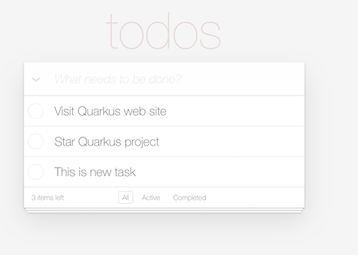

# TODO Application

- [TODO Application](#todo-application)
  - [OpenTelemetry and Jaeger](#opentelemetry-and-jaeger)
  - [To-Do App](#to-do-app)
  - [Test](#test)

## OpenTelemetry and Jaeger

- Start OpenTelemetry and All-in-One Jaeger with Docker Compose
  
  ```bash
  cd todo/etc
  docker-compose up -d
  ```

## To-Do App

- Start Todo App in Dev Mode
  
  ```bash
  cd todo
  mvn quarkus:dev
  ```

## Test
- Access [todo app](http://localhost:8080/) then add and delete tasks
  
  - Delete and add tasks

     


- Access [Jaeger Console](http://localhost:16686) 
  - Select operation e.g. *UPDATE*
  
    

  - Overall trace detail
  
    

  - View span detail. Notice *SQL statement* and *duration*
  
    
  

  
